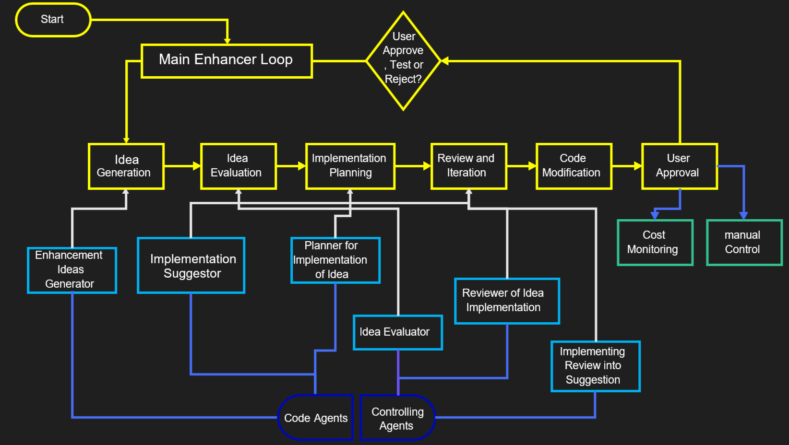

# 🧠 Self-Enhancing AI Codebase (v0.11)

> An experimental framework for exploring AI-driven code optimization

## 🚀 Project Overview

The Self-Enhancing AI Codebase Project (Version 0.10) is an experiment that utilizes artificial intelligence to autonomously improve and extend its own source code. This system will gather improvement ideas and implement them. Current status is that idea generation is done.
Version 0.1 is a complete overhaul using Langchain, for a semi-working prototype see branch 0.02.

## ✨ GOAL: Key Features

1. 🤖 Autonomous Improvement: The system can generate, evaluate, and implement improvement ideas.
2. 👥 Multi-Agent Architecture: Uses separate agents for code generation and control/verification.
3. 🎛️ Interactive User Control: Allows users to approve, test, or reject proposed changes.
4. 🔄 Version Control Integration: Works seamlessly with Git for change management.
5. 💰 Cost Monitoring: Monitors and reports API usage and associated costs.
6. 🔒 Safe Codebase Modification: Works on a copy of the original codebase to prevent unintended changes.


## 🏗️ System Architecture of branch 0_02



The project consists of several key components:

- CodeAgent: Responsible for generating improvement ideas, planning implementations, and suggesting code changes.
- ControllingAgent: Evaluates ideas, reviews implementations, and ensures quality control.
- Enhancer: The main orchestrator that manages the improvement cycles and user interactions.

## 🔄 Improvement Process

1. 💡 Idea Generation: The system analyzes the current codebase and suggests potential improvements.
2. ⚖️ Idea Evaluation: Ideas are evaluated based on their potential impact and feasibility.
3. 📝 Implementation Planning: A step-by-step plan is created for each selected idea.
4. 🛠️ Code Modification: The system suggests specific code changes to implement each step.
5. 🔍 Review and Iteration: Proposed changes are reviewed, possibly modified, and iterated until satisfactory.
6. 👍 User Approval: Users can choose to test, directly apply, or reject changes.

## 🚀 Getting Started

1. Clone the repository:   
```shell
git clone git@github.com:AntonKettner/SelfEnhancer.git
cd SelfEnhancer
```

2. Install the dependencies:   
```shell
pip install -r requirements.txt
```

```shell
pip install "unstructured[md]"
```
3. Set up your OpenAI API key in the `.env` file (see Configuration section below)

4. Run the Enhancer:
```shell
python enhancer.py
```

## ⚙️ Configuration

The project uses environment variables for configuration.

### edit `.env` file to include your OpenAI API key (i.e. with nano)

```shell
nano .env
```

### Optional Configuration of Default Settings:

`MAX_RAG_VECTOR_NO` = 3

`RAG_FILETYPES` = ["py", "txt", "md"]

`MIN_RELEVANCE_SCORE` = 0.58    # 0 similarity score means it is the same Vector, 1 means it is completely different

`HUMAN_IN_THE_LOOP` = True

`LLM_MODEL` = "gpt-4o-mini"

`IDEA_GENERATION` = True

Remember to keep your `.env` file secure and never commit it to version control. The `.gitignore` file in this project is set up to exclude the `.env` file by default.

### 🔮 Outlook

- [ ] Add implementation similar to branch 0.02.
- [ ] Change implementation to be more consistent.
- [ ] Add testing with pylint or other linters.
- [ ] Add filetree and overview of code into LLMs
